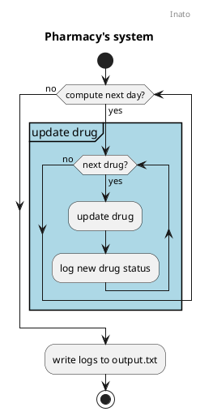

# Introduction

This page is a quick documentation of the Inato Pharmacy project.  
A simple Markdown page is used instead of Github's wiki to ease the reviewing process of the home test.

# Table of Contents

- [Pharmacy](#pharmacy)
- [Drugs](#drugs)

# Pharmacy

The pharmacy system keeps track of the available drugs to distribute.  
It updates the expiration and benefit of each drug entity on a daily basis following each drugs' rules that are detailed
in [the drug section](#drugs).

# Drugs

Generally speaking, drugs' benefits decay over time following these rules:

- A drug is considered expired when its expiration is less or equal to 0.
- $0 ≤ benefit ≤ 50$

| Status                  | Expiration coefficient | Benefit coefficient |
|-------------------------|------------------------|---------------------|
| $∞ > D > 0$ (standard)  | -1                     | -1                  |
| $0 ≥ D > -∞$ (expired)  | -1                     | -2                  |

⚠ The above table is basic but some drugs may behave differently.
Always check the related documentation to a drug.

This section lists the different drugs implemented in the system:

- [Doliprane](#doliprane)
- [Fervex](#fervex)
- [Herbal Tea](#herbal-tea)
- [Magic Pill](#magic-pill)

## Dafalgan

Dafalgan degrades in Benefit twice as fast as normal drugs.

| Status                  | Expiration coefficient | Benefit coefficient |
|-------------------------|------------------------|---------------------|
| $∞ > D > 0$ (standard)  | -1                     | -2                  |
| $0 ≥ D > -∞$ (expired)  | -1                     | -4                  |

## Doliprane

Doliprane does not have any specific behaviour and follows [general drug rules](#drugs).

## Fervex

Fervex increases in Benefit as its expiration date approaches. Benefit increases by 2 when there are 10 days or less and
by 3 when there are 5 days or less but Benefit drops to 0 after the expiration date.

| Expiration status | Expiration coefficient | Benefit coefficient |
|-------------------|------------------------|---------------------|
| $∞ > D > 10$      | -1                     | +1                  |
| $10 ≥ D > 5$      | -1                     | +2                  |
| $5 ≥ D > 0$       | -1                     | +3                  |
| $0 ≥ D > -∞$      | -1                     | =0                  |

## Herbal Tea

Herbal Tea actually increases in Benefit the older it gets. Benefit increases twice as fast after the expiration date.

| Expiration status | Expiration coefficient | Benefit coefficient |
|-------------------|------------------------|---------------------|
| $∞ > D > 0$       | -1                     | +1                  |
| $0 ≥ D > -∞$      | -1                     | +2                  |

## Magic Pill

Magic Pill never expires nor decreases in Benefit.

| Expiration status | Expiration coefficient | Benefit coefficient |
|-------------------|------------------------|---------------------|
| $∞ > D > -∞$      | -0                     | -0                  |
